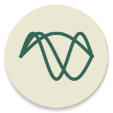

  

# Harmonic for Hacker News

A fully-featured, mature Hacker News client for Android with a focus on (material) design, polish, and customization.

  

Over nearly 6 years of development, Harmonic has been been accumulating features and relentlessly improving all of the hundreds of small interactions which make up the app. It is my main personal side project which I use daily and has over 100 000 downloads on Google Play. It is not meant as a display of the best code quality, but rather as the product of continuous iteration and pixel pushing.

## Features

* Full account functionality: log in, vote, comment, submit, favorites, see upvoted
* Material 3 Expressive design with nice animations
* Theming support and extensive customization options
* A large collection of quality of life features such as reader mode, preview images, link previews and much more
* Strong smooth performance

## Contributing

If you would like to see a change in Harmonic, feel free to open an issue or create a PR. Historically, most PRs are merged and I might make some design changes to make sure Harmonic stays consistent. Try to stay within the general code style of the codebase but I make no claim that the current state is holy by any means. Harmonic is meant to be beautiful from the front more so than the back and user experience is king. With that said, PRs which clean up the code or improve structure are very welcome as well. When a PR adds a new user-facing feature, I will add that feature to the changelog after merging. If you do NOT want your name there, let me know by e.g., writing so in the PR.

### AI-aided PRs

Using your favorite LLM workflow to create PRs is completely fine - anything that gets the job done. As always, still build the app (this should be hassle-free) and try out your changes to make sure they work properly before before submitting a PR.

### Code

Harmonic is written in Java mainly with views, old-school Android style. With MDC-Android (Views) being end of life, there will be a need to migrate to Kotlin Compose at some point in the future. While you are welcome to contribute to that, don't be afraid of using views as long as the rest of the app does.
  

